## 0.运行环境

​	Pycharm2024（为了防止你配不好环境，我抛弃了vscode，是不是很贴心！）

​	Anaconda3

​	Windows11

## 1.配置环境

### 1.1 创建conda环境

​	在Anaconda prompt中

```bash
conda create --name TG python=3.11
```

​	在pycharm中的右下角，选择`添加新的解释器`-`添加本地解释器`-`现有`

​	找到你刚才创建好的conda虚拟环境，如果不知道位置，可以使用命令，找到你的虚拟环境地址

```bash
conda env list
```

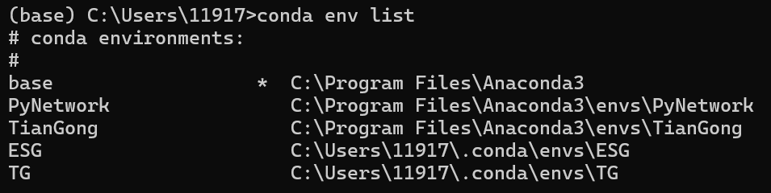

​	选择虚拟环境下的`python.exe`文件到解释器中

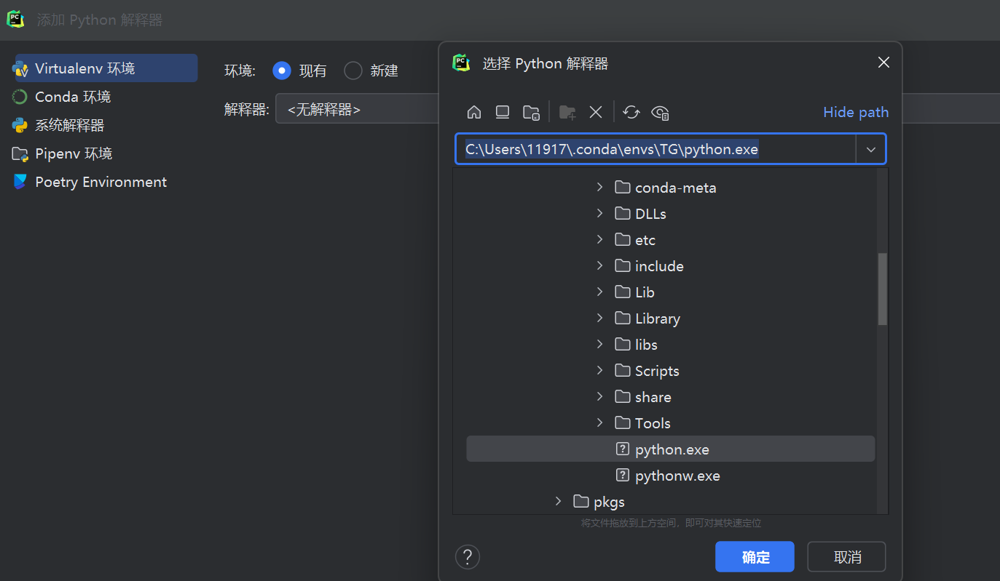

### 1.2 配置依赖项

在Pycharm终端执行命令：

```bash
pip install python-dotenv
pip install PyMuPDF
```

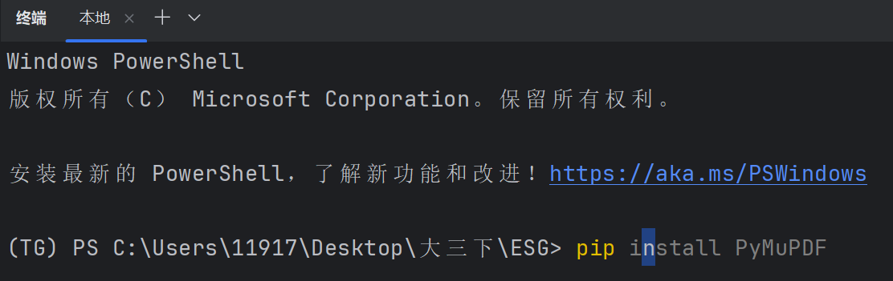

注意，如果你想要在Anaconda prompt中执行命令，需要先激活虚拟环境

```bash
conda activate TG
```

### 1.3 其他配置

**本项目的目录树结构**：

```bash
ESG
├── download               # 存放下载的PDF文件
├── esg_pickle             # 存放从PDF中提取的数据的pickle文件
├── esg_txt                # 存放从PDF中提取的数据的文本数据
├── readme.assets          # 存放readme文件中引用的资源，如图片等
├── src                    # 源代码文件夹，包含所有Python脚本
│   ├── chunk_by_acknowledgements.py           # 提取PDF中致谢部分的脚本
│   ├── chunk_by_acknowledgements_xata.py      # 废弃版本，不重要，请忽略
│   ├── create_xata_table.py                   # 用于创建xata数据表格的脚本
│   ├── download_pdf.py                        # 用于下载PDF文件的脚本
│   ├── upload_pdf.py                          # 用于上传PDF文件的脚本
├── uploads                 # 存放需要上传的文件
├── .env                   # 环境变量文件，存储敏感数据或配置
└── readme.md              # 项目的Markdown格式的文档，说明项目信息和使用说明

```

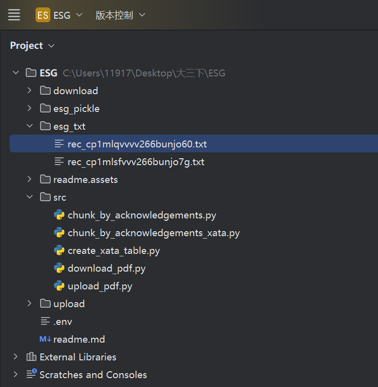

 **在文件根目录下**

- 创建`.env`文件，配置你的api，具体操作参考xata官网https://xata.io/

```txt
XATA_API_KEY=
XATA_DB_URL=
```

- 创建文件夹：`upload、download、esg_pickle、esg_txt`

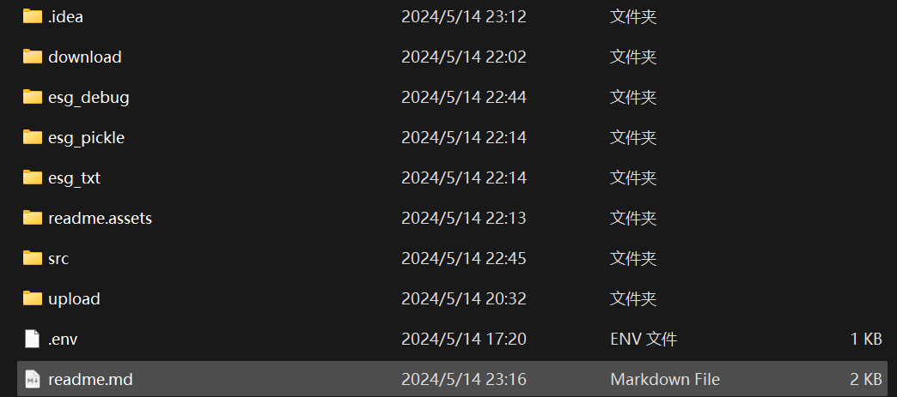

## 2.在xata数据库中创建表

- 运行`create_xata_table.py` 

​	(如果你使用了github的api，建议之后的操作都挂vpn)

​	如果代码顺利运行，将输出`Database tables created successfully.`

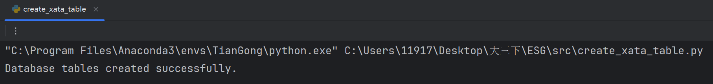

​	刷新xata数据库，可以发现已经创建ESG_Reports

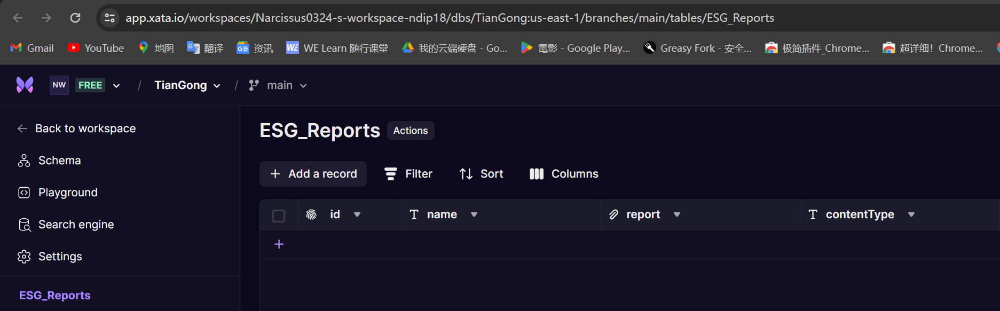

## 3.上传需要处理的PDF文件

#### **注意：3、4步在期望多设备使用该项目是必要的**

#### 但如果你只想在本地完成，你可以将待处理的文件存放到download文件夹下，然后直接跳转第5步

- 将需要处理的PDF文件放到upload文件夹下

- 运行`upload_pdf.py`

  如果运行成功，结果如下，可以看到xata数据库中已经插入了对应记录

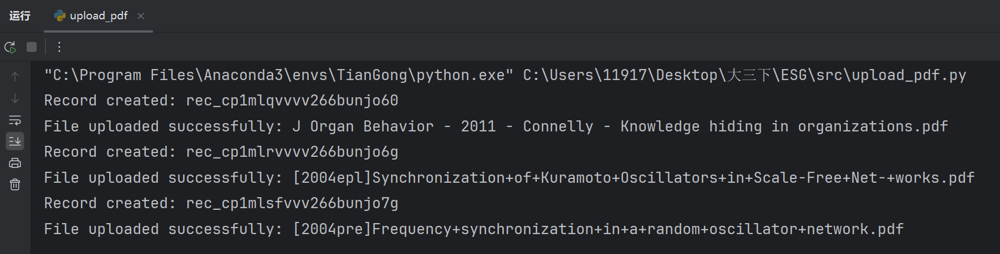

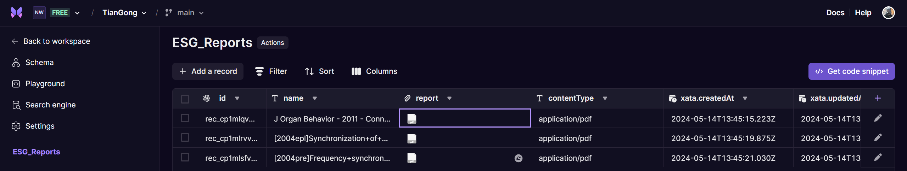

## 4.下载需要处理的PDF文件

​	运行`download_pdf.py`

​	如果成功运行，结果如下：

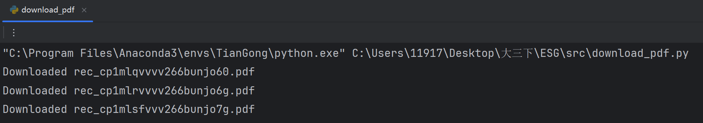

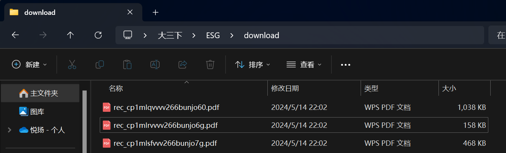

## 5.处理下载到download的PDF文件

​	运行`chunk_by_acknowledgements.py`

​	如果成功运行，代码将输出：

```
发现{len(pdf_files)}个PDF文件，准备开始处理。
if 找到致谢部分
	文本已保存至pickle：{record_id}.pkl
	文本已保存至txt文件：{record_id}.txt
else 
	未找到致谢部分：{file_path}
```

​	运行结果储存在esg_txt和esg_pickle文件夹下

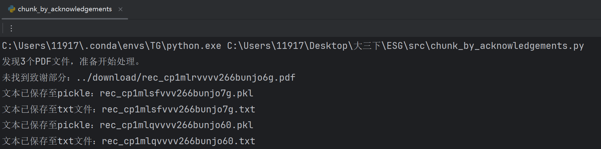

​	案例运行结果如下：

​	原文：

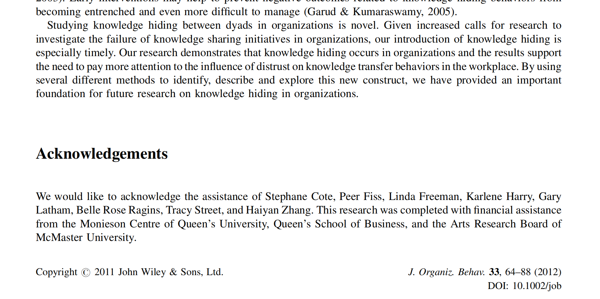

​	代码输出结果：

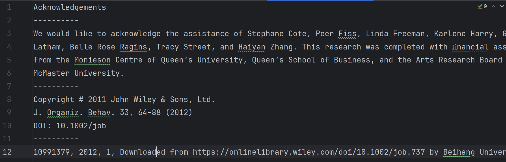

​	原文：

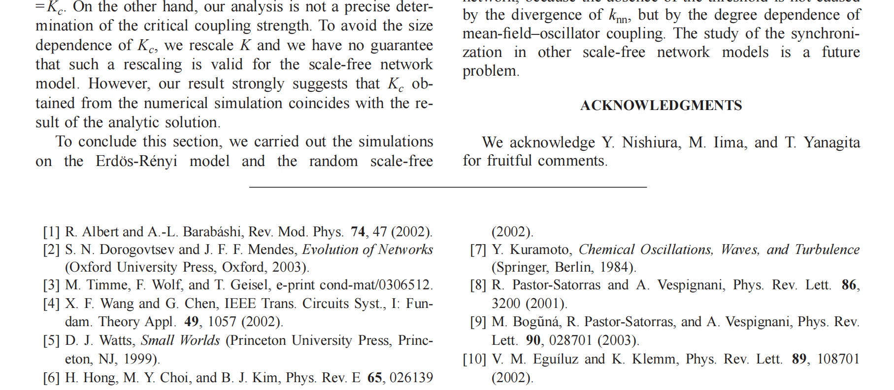

​	代码输出结果：

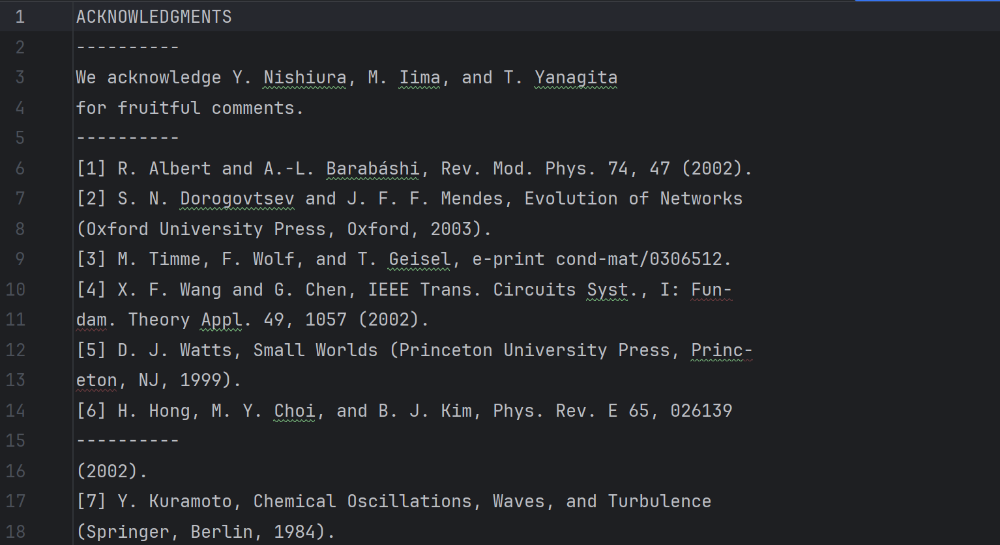